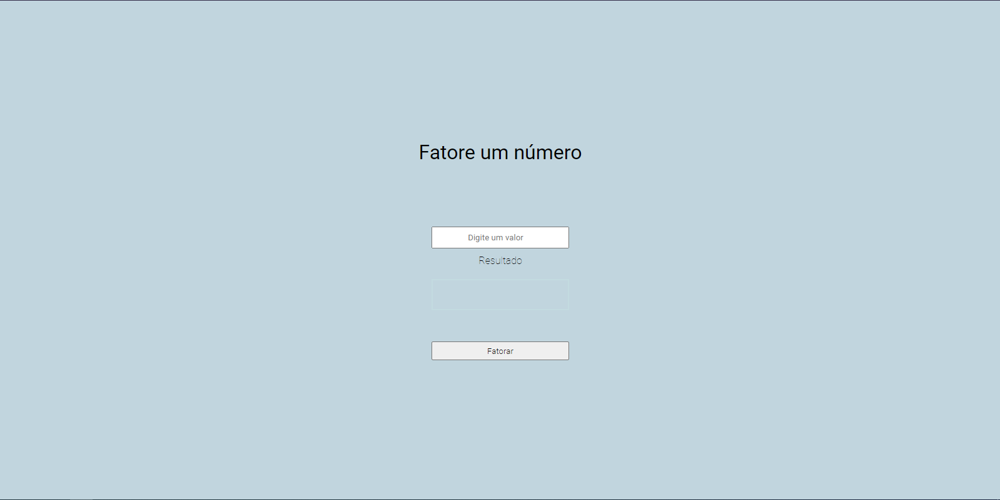

## Factor a number 📚

<p> This is a simple application, to test my knowledge in javascript and css </p>

<br/>

### Usage 👨‍💻
<p> To edit the code just copy the url and use the 'git clone' in a desired directory
like this:</p>

```
$git clone https://github.com/hash-luk/factor-project.git
```
<p> and open 'Index.html' with 'Live Server'</p>
<br>

### Print 📷



<br>
<br>

<footer>
<p style="text-align:center">
Copyright © Lucas Patrick, 2021
</p>
</footer>


